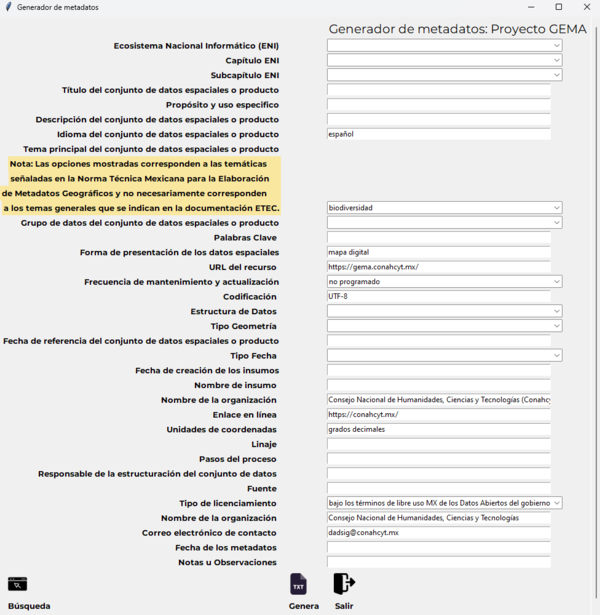
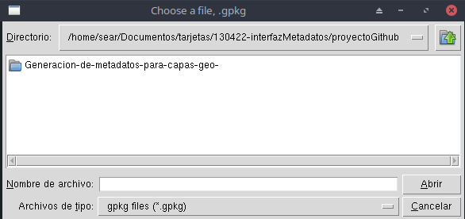
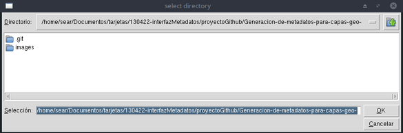

# Generación de metadatos para capas georrefereciadas 🌎
Generación de fichas de metadatos en base a la *Norma Técnica para la elaboración de Metadatos geográficos*.

## 📋 Resumen

Una herramienta para generar fichas de metadatos conforme a la *Norma Técnica para la Elaboración de Metadatos Geográficos (NTMG)*, en formatos **TXT** y **HTML**.

Esta aplicación ofrece una interfaz interactiva que facilita la generación de fichas de metadatos para capas geoespaciales, siguiendo los estándares definidos por la *Norma Técnica para la Elaboración de Metadatos Geográficos*. Su objetivo principal es garantizar una documentación adecuada y estandarizada, que permita un uso efectivo y organizado de los datos geoespaciales.

## 📖 Introducción
El desarrollo de esta herramienta responde a la necesidad de una solución para documentar y gestionar metadatos de capas geoespaciales, como parte del Proyecto de Investigación GEMA (P.I.GEMA).

Los datos geográficos son compartidos y reutilizados cada vez más en contextos distintos a los previstos por sus creadores. La documentación adecuada mediante metadatos es fundamental para:

* **Identificar y seleccionar** conjuntos de datos relevantes.
* **Garantizar la integridad** y calidad de los datos geoespaciales.
* **Facilitar su intercambio** y uso en diversos proyectos.

## 🚀 Cómo usar la aplicación

Sigue los pasos a continuación para ejecutar la aplicación y generar tus metadatos:

1. **Ejecuta la aplicación**  
   Con tu entorno virtual activado, navega al directorio:  
   `sisdai-etec-espacializacion/procesamiento/python/modulos/generador_metadatos`  
   Luego, escribe el siguiente comando en la terminal para iniciar la aplicación:

   ```bash
   python principal.py
   ```

Aparecerá la interfaz de la aplicación, como se muestra a continuación:



2. **Cargar los datos geoespaciales**: Utiliza la herramienta para subir la capa geográfica que deseas documentar.



3. **Completar los campos de metadatos**: Llena los campos requeridos conforme a la **Norma Técnica para la Elaboración de Metadatos Geográficos (NTMG)**. Algunos valores están predefinidos, pero puedes editarlos según sea necesario.

4. ⚠️ Importante
Al finalizar la edición de los campos en la interfaz, será necesario agregar las descripciones de los atributos de tu capa geográfica. Este paso se realiza en la terminal:

    * Aparecerá el nombre del primer atributo de tu capa. Ingresa su descripción y presiona `Enter`.
    * Repite este proceso para cada atributo hasta completar la lista.

5. **Genera y exporta los metadatos**: Haz clic en el botón `Genera` y selecciona el directorio donde se guardarán los archivos **TXT** y **HTML** generados. 



6. **Evaluar un nuevo conjunto de datos**: Si deseas procesar otra capa geográfica, haz clic en el botón `Búsqueda` y repite los pasos 2 al 5.

7. **Cierra la aplicación**:Para salir de la herramienta, presiona el botón `Salir`.

## 📦 Estructura de archivos

```plaintext
SISDAI-ETEC-ESPACIALIZACION/
├── datos/
│   ├── datos-auxiliares/
│   ├── datos-originales/
│   ├── datos-procesados/
│   │   └── .gitkeep
├── procesamiento/
│   ├── python/
│   │   ├── cuadernos/
│   │   └── modulos/
│   │       └── generador_metadatos/
│   │           ├── images/
│   │           ├── principal.py
│   │           ├── README.md
│   │           └── template-v2.html
```

## 📜 Licencia

SOFTWARE LIBRE Y ESTÁNDARES ABIERTOS

Sisdai está alineado a las disposiciones establecidas por la Coordinación de Estrategia Digital Nacional (DOF: 06/09/2021) en donde se estipula que las "políticas y disposiciones tienen como objetivo fortalecer el uso del software libre y los estándares abiertos, fomentar el desarrollo de aplicaciones institucionales con utilidad pública, lograr la autonomía, soberanía e independencia tecnológicas dentro de la APF". En el artículo 63 se explicita que "cuando se trate de desarrollos basados en software libre, se respetarán las condiciones de su licenciamiento original [...]", en este sentido este proyecto está alineado a lo que se define desde [SALSA.](https://salsa.crip.conacyt.mx/)